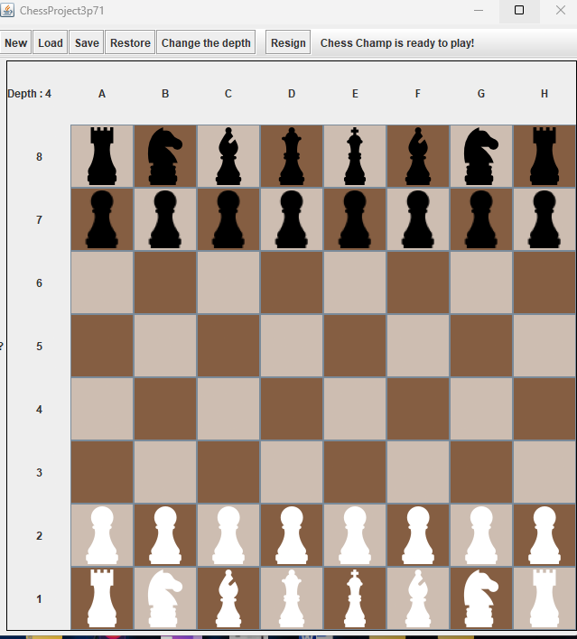

# ♟ ChessGame

> A fully playable chess game with an AI opponent, written in Java.

 

---

## Preview



---

## About

ChessGame is a fully playable chess game built in Java with a GUI and an AI opponent powered by minimax with alpha-beta pruning. Built as a university project for COSC 3P71 by Royce Lando and Joel Liju Jacob.

The board is represented as a 2D array of `Piece` objects, each piece implementing an abstract `Piece` class. The AI evaluates positions using a custom heuristic that considers material count, square control, and piece defence.

---

## Features

- Full chess rules — legal move validation, check, checkmate, and stalemate detection
- Special moves — castling, en passant, and pawn promotion
- GUI with toolbar (New, Load, Save, Restore, Resign)
- Save and load game states from file
- AI opponent using minimax with alpha-beta pruning
- Custom evaluation function — material, square control, and piece defence
- Pop-up dialogs for invalid moves and pawn promotion

---

## AI

The AI uses **alpha-beta pruning** (an optimised minimax) to search for the best move up to a configurable depth. Rather than building the full decision tree upfront, it evaluates one node at a time and nullifies children after processing to reduce memory pressure and allow Java's garbage collector to free unused nodes.

The evaluation function scores positions based on:
- **Material** — total piece value for the perspective side minus the opponent's
- **Square control** — squares a piece can legally move to (rewards center control)
- **Piece defence** — whether pieces are protected or hanging

> Note: performance degrades noticeably beyond depth 5.

---

## Getting started

### Run the jar directly

```bash
java -jar ChessProject.jar
```

### Build from source

```bash
git clone https://github.com/Roycelando/ChessGame
cd ChessGame
javac src/**/*.java
# Run from outside the src folder
java GUI.ChessboardwithColumnsandRows
```

> Important: run the program from outside the `src` folder — file paths depend on this.

---

## How to play

- Press **New** to start a fresh game
- Press **Load** to load a saved game state from a file
- Press **Save** to save the current board state
- Press **Resign** to end the game
- To **castle**, click the king and move it two squares left or right (if conditions are met)
- When a pawn reaches the promotion rank, a pop-up will ask which piece to promote to

### Board file format

Custom board states can be loaded from a file. Empty squares are `.`, white pieces are uppercase, black pieces are lowercase:

```
r n b q k b n r
p p p p p p p p
. . . . . . . .
. . . . . . . .
. . . . . . . .
. . . . . . . .
P P P P P P P P
R N B Q K B N R
```

Piece key: `p` = pawn, `r` = rook, `n` = knight, `b` = bishop, `q` = queen, `k` = king

---

## Project structure

```
ChessGame/
├── src/
│   ├── Game/       # GameMaster, Evaluation, Node (decision tree)
│   ├── GUI/        # Chessboard UI, pop-ups, toolbar
│   ├── Pieces/     # Piece abstract class, all 6 piece types, Rank enum
│   └── Test/       # Manual test cases
├── ChessProject.jar
├── test            # Default starting board state
├── saved           # Saved game state
└── .gitignore
```

---

## Known limitations

- No 50-move rule or 3-fold repetition stalemate
- Only one game can be saved at a time (overwrites previous save)
- If the black side has no king, the game ends immediately
- AI slows significantly beyond depth 5

---

## References

- [Chess position heuristics — Quora](https://www.quora.com/What-are-some-heuristics-for-quickly-evaluating-chess-positions)
- [Alpha-beta pruning paper](http://citeseerx.ist.psu.edu/viewdoc/download?doi=10.1.1.76.1444&rep=rep1&type=pdf)
- [Minimax explained — YouTube](https://www.youtube.com/watch?v=l-hh51ncgDI)

---

*By Royce Lando & Joel Liju Jacob — COSC 3P71, 2020*
